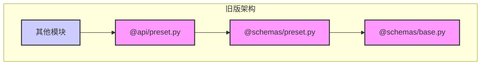
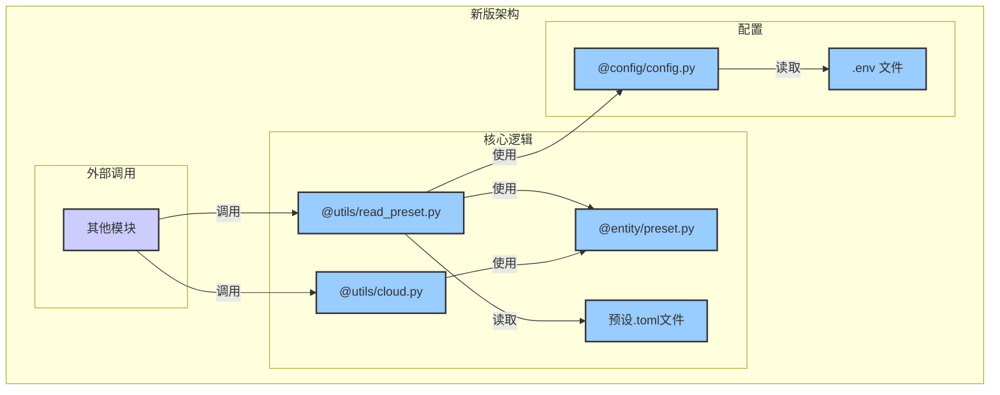

# 项目架构图

## 旧版架构

```mermaid
graph TD
    subgraph "旧版架构"
        A["@api/preset.py"] --> B["@schemas/preset.py"];
        B --> C["@schemas/base.py"];
        D["其他模块"] --> A;
    end

    style A fill:#f9f,stroke:#333,stroke-width:2px;
    style B fill:#f9f,stroke:#333,stroke-width:2px;
    style C fill:#f9f,stroke:#333,stroke-width:2px;
    style D fill:#ccf,stroke:#333,stroke-width:2px;
```

## 新版架构

```mermaid
graph TD
    subgraph "新版架构"
        subgraph "配置"
            A1["@config/config.py"] -- 读取 --> A2[".env 文件"];
        end
        
        subgraph "核心逻辑"
            B1["@utils/read_preset.py"] -- 使用 --> C1["@entity/preset.py"];
            B1 -- 读取 --> B2["预设.toml文件"];
            B1 -- 使用 --> A1;

            D1["@utils/cloud.py"] -- 使用 --> C1;
        end

        subgraph "外部调用"
            E1["其他模块"] -- 调用 --> B1;
            E1 -- 调用 --> D1;
        end
    end

    style A1 fill:#9cf,stroke:#333,stroke-width:2px;
    style A2 fill:#9cf,stroke:#333,stroke-width:2px;
    style B1 fill:#9cf,stroke:#333,stroke-width:2px;
    style B2 fill:#9cf,stroke:#333,stroke-width:2px;
    style C1 fill:#9cf,stroke:#333,stroke-width:2px;
    style D1 fill:#9cf,stroke:#333,stroke-width:2px;
    style E1 fill:#ccf,stroke:#333,stroke-width:2px;
```
